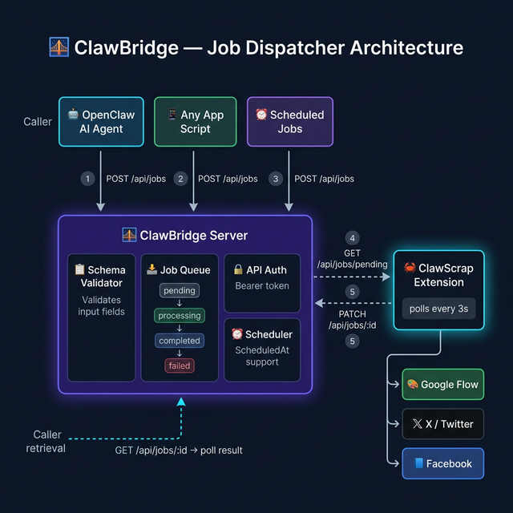

# 🌉 ClawBridge

**Super Bridge Server** — A generic job dispatcher that connects your apps and AI agents to browser automation extensions.

Define job types with full I/O schemas, schedule jobs, and let connected extensions handle the rest.

---



## ✨ Features

- 🔌 **Plugin ecosystem** — any extension connects and declares which job types it handles
- 📋 **Schema-driven validation** — each job type has strict input/output schemas; bridge validates automatically
- ⏰ **Job scheduling** — submit jobs to run immediately or at a future time (ISO 8601 or Unix ms)
- 🔒 **API key auth** — optional Bearer token for VPS deployments
- 🤖 **AI agent friendly** — `GET /api/types` returns full schemas so agents auto-discover capabilities
- 🔄 **Auto-reconnect** — extensions that reconnect with the same name replace old connections automatically

---

## 🔌 Compatible Extensions

| Extension | Job Types | Description |
|-----------|-----------|-------------|
| [ClawScrap](https://github.com/ionodeionode/clawscrap) | `flow_generate`, `post_x`, `post_facebook` | Browser automation for AI image gen + social posting |

---

## 📋 Requirements

- **Node.js** 18+

---

## 🚀 Quick Start

```bash
git clone https://github.com/benteckxyz/clawbridge
cd clawbridge
npm install
node server.js
```

Server starts at `http://localhost:3002`.

### With API Key authentication

```bash
API_KEY=your-secret-key node server.js
```

When `API_KEY` is set, all requests (except `GET /health`) require:
```
Authorization: Bearer your-secret-key
```

---

## 📡 API Reference

### Authentication

| Condition | Behavior |
|-----------|----------|
| `API_KEY` not set | All endpoints public (local dev) |
| `API_KEY` set | All endpoints require `Authorization: Bearer <key>` |
| `GET /health` | Always public |

---

### 🏥 Health Check

```http
GET /health
```

Always public. Returns server status and connected extension count.

**Response:**
```json
{
  "status": "ok",
  "jobCount": 3,
  "supportedTypes": ["flow_generate", "post_x", "post_facebook"],
  "connectedExtensions": 1
}
```

---

### 🔌 Extension Management

Extensions (e.g. ClawScrap) connect to the bridge, declare which job types they handle, then poll for work.

---

#### `POST /api/extensions/connect`

Register an extension with the bridge. Returns an `extensionId` used for polling.

**Request Body:**
```json
{
  "name": "ClawScrap",
  "types": ["flow_generate", "post_x", "post_facebook"]
}
```

| Field | Type | Required | Description |
|-------|------|----------|-------------|
| `name` | string | ✅ | Extension display name. Reconnecting with same name replaces old connection. |
| `types` | string[] | ✅ | Job types this extension handles. Must match supported types. |

**Response `200`:**
```json
{
  "success": true,
  "extensionId": "a1b2c3d4-...",
  "name": "ClawScrap",
  "acceptedTypes": ["flow_generate", "post_x", "post_facebook"]
}
```

**Error `400` — unknown type:**
```json
{
  "success": false,
  "error": "Unsupported job type(s): my_type. Available: flow_generate, post_x, post_facebook"
}
```

---

#### `GET /api/extensions`

List all currently connected extensions.

**Response:**
```json
{
  "success": true,
  "extensions": [
    {
      "id": "a1b2c3d4-...",
      "name": "ClawScrap",
      "types": ["flow_generate", "post_x", "post_facebook"],
      "connectedAt": 1741234567890,
      "lastPollAt": 1741234599000
    }
  ]
}
```

---

#### `DELETE /api/extensions/:extensionId`

Disconnect an extension manually.

**Response `200`:**
```json
{ "success": true }
```

**Error `404`:**
```json
{ "success": false, "error": "Extension not found" }
```

---

### 📋 Job Types

#### `GET /api/types`

List all supported job types with their full input/output schemas. Useful for AI agents to auto-discover capabilities.

**Response:**
```json
{
  "success": true,
  "types": [
    {
      "type": "flow_generate",
      "label": "AI Image Generation",
      "description": "Generate AI images via Google Flow",
      "input": {
        "required": { "prompt": "string" },
        "optional": { "model": "string", "orientation": "string", "count": "number" }
      },
      "output": {
        "imageBase64": "string",
        "imageUrls": "string[]"
      }
    },
    {
      "type": "post_x",
      "label": "Post to X/Twitter",
      "description": "Compose and post tweets with text + images",
      "input": {
        "required": { "text": "string" },
        "optional": { "mediaUrls": "string[]" }
      },
      "output": {
        "message": "string",
        "postUrl": "string"
      }
    },
    {
      "type": "post_facebook",
      "label": "Post to Facebook",
      "description": "Post to personal profile or Facebook pages with media",
      "input": {
        "required": { "text": "string" },
        "optional": { "mediaUrls": "string[]", "target": "string" }
      },
      "output": {
        "message": "string",
        "postUrl": "string"
      }
    }
  ]
}
```

---

### 📥 Job Operations

#### Job Statuses

| Status | Description |
|--------|-------------|
| `scheduled` | Waiting for scheduled time to arrive |
| `pending` | Ready to be picked up by an extension |
| `processing` | An extension is currently working on it |
| `completed` | Finished successfully with result |
| `failed` | Failed with error message |

---

#### `POST /api/jobs`

Submit a new job. Bridge validates all fields against the job type's schema.

**Headers:**
```
Authorization: Bearer <key>   (if API_KEY is set)
Content-Type: application/json
```

**Request Body — common fields:**

| Field | Type | Required | Description |
|-------|------|----------|-------------|
| `type` | string | ✅ | Job type (e.g. `flow_generate`, `post_x`, `post_facebook`) |
| `scheduledAt` | string \| number | ❌ | ISO 8601 string or Unix ms timestamp. Omit for immediate. |
| `...payload` | — | — | Additional fields per job type (see below) |

---

**Example — Generate AI image (immediate):**
```json
{
  "type": "flow_generate",
  "prompt": "a sunset over Vietnamese rice fields, cinematic, golden hour"
}
```

**Example — Generate AI image (with options):**
```json
{
  "type": "flow_generate",
  "prompt": "a futuristic city at night",
  "model": "v2",
  "orientation": "landscape",
  "count": 4
}
```

---

**Example — Post to X/Twitter:**
```json
{
  "type": "post_x",
  "text": "Hello from ClawBridge! 🌉 #automation"
}
```

**Example — Post to X with image:**
```json
{
  "type": "post_x",
  "text": "Check out this AI-generated image! 🎨",
  "mediaUrls": ["https://example.com/image.jpg"]
}
```

---

**Example — Post to Facebook (personal profile):**
```json
{
  "type": "post_facebook",
  "text": "Sharing something cool today! 🚀",
  "mediaUrls": ["https://example.com/image.jpg"]
}
```

**Example — Post to Facebook Page:**
```json
{
  "type": "post_facebook",
  "text": "New update from our page!",
  "target": "page:mypagename"
}
```

> `target` format: `"page:<facebook-page-username>"`. Omit for personal profile.

---

**Example — Scheduled job:**
```json
{
  "type": "post_x",
  "text": "Good morning! ☀️",
  "scheduledAt": "2026-03-10T08:00:00+07:00"
}
```

**Response `200`:**
```json
{
  "success": true,
  "jobId": "9f26...",
  "type": "flow_generate",
  "status": "pending",
  "scheduledAt": null
}
```

**Error `400` — validation failure:**
```json
{
  "success": false,
  "errors": ["text is required (string)"]
}
```

---

#### `GET /api/jobs/pending?extensionId=<id>`

Poll for the next pending job matching the extension's registered types. Called repeatedly by extensions.

**Query Params:**

| Param | Required | Description |
|-------|----------|-------------|
| `extensionId` | ✅ | ID returned from `/api/extensions/connect` |

**Behavior:**
- Updates `lastPollAt` for the extension
- Promotes any `scheduled` jobs whose time has arrived to `pending`
- Returns the first `pending` job matching this extension's types and marks it `processing`
- Returns `job: null` if no pending jobs are available

**Response — job available:**
```json
{
  "success": true,
  "job": {
    "id": "9f26...",
    "type": "flow_generate",
    "payload": { "prompt": "a sunset..." },
    "scheduledAt": null,
    "status": "processing",
    "result": null,
    "error": null,
    "createdAt": 1741234567890,
    "updatedAt": 1741234571000
  }
}
```

**Response — no jobs:**
```json
{
  "success": true,
  "job": null
}
```

**Error `401` — extension not connected:**
```json
{
  "success": false,
  "error": "Extension not connected. Call POST /api/extensions/connect first"
}
```

---

#### `PATCH /api/jobs/:jobId`

Report the result of a job (called by the extension after completing work).

**Request Body:**

| Field | Type | Description |
|-------|------|-------------|
| `status` | string | `"completed"` or `"failed"` |
| `result` | object | Output data (job-type specific) |
| `error` | string | Error message if failed |

**Example — completed flow_generate:**
```json
{
  "status": "completed",
  "result": {
    "imageBase64": "data:image/jpeg;base64,/9j/4AAQ...",
    "imageUrls": ["https://labs.google/fx/api/trpc/..."]
  }
}
```

**Example — failed job:**
```json
{
  "status": "failed",
  "error": "Generate button not found on page"
}
```

**Response `200`:**
```json
{
  "success": true,
  "job": { "id": "9f26...", "status": "completed" }
}
```

**Error `404`:**
```json
{ "success": false, "error": "Job not found" }
```

---

#### `GET /api/jobs/:jobId`

Check the current status and result of a specific job.

**Response:**
```json
{
  "success": true,
  "job": {
    "id": "9f26...",
    "type": "flow_generate",
    "payload": { "prompt": "a sunset..." },
    "scheduledAt": null,
    "status": "completed",
    "result": {
      "imageBase64": "data:image/jpeg;base64,/9j/...",
      "imageUrls": ["https://labs.google/fx/api/trpc/..."]
    },
    "error": null,
    "createdAt": 1741234567890,
    "updatedAt": 1741234601000
  }
}
```

---

#### `GET /api/jobs`

List all jobs (most recent first). Summary view — does not include full result data.

**Response:**
```json
{
  "success": true,
  "jobs": [
    {
      "id": "9f26...",
      "type": "flow_generate",
      "label": "a sunset over Vietnamese rice fields...",
      "status": "completed",
      "createdAt": 1741234567890,
      "hasResult": true
    }
  ]
}
```

> Max 100 jobs kept in memory. Oldest jobs are dropped automatically when limit is reached.

---

## 🔄 Typical Flow

```
App / AI Agent                  ClawBridge                    ClawScrap (Extension)
─────────────────────────────────────────────────────────────────────────────────────
                                                    ← POST /api/extensions/connect
                                ← extensionId ────────────────────────────────────

POST /api/jobs ────────────────→ job created (pending)
GET  /api/jobs/:id polling ───→ status: pending

                                                    ← GET /api/jobs/pending?extensionId=...
                                → job (processing) ──────────────────────────────→
                                                            [executes in browser]
                                                    ← PATCH /api/jobs/:id (completed)

GET  /api/jobs/:id ───────────→ status: completed
                                  result: { imageBase64, imageUrls }
```


---

## 🔒 VPS Deployment

> **Important:** Use HTTPS (nginx + Let's Encrypt) to protect your API key in transit.

```bash
API_KEY=your-secret-key PORT=3002 node server.js
```

---

## ⚠️ Disclaimer

For educational and personal use only. Users are responsible for compliance with third-party platform Terms of Service.

---

## 📄 License

MIT
